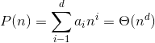
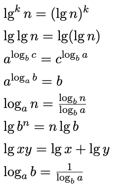

## mit_introduction_to_algorithims_6.006
This is my work through 6.006 course, introduction to algorithms.
[Course website](https://ocw.mit.edu/courses/electrical-engineering-and-computer-science/6-006-introduction-to-algorithms-fall-2011/lecture-videos/)
### why do we use   in algorithims analysis ?
 You might expect that this is because computers represent numbers in binary, but usually that is not why, 
   is (with suitable rounding)   the number of times you can divide n by 2 before reaching 1

### why the worst case occurs when the bottom level of the tree is exactly half full?
- `The children's subtrees each have size at most 2n/3 - the worst case occurs when the last row of the tree is exactly half full`
Since the running time `T(n)` is analysed by the number of elements in the tree `(n)`, and the recursion steps into one of the subtrees, we need to find an upper bound on the number of nodes in a subtree, relative to n, and that will yield that` T(n) = T(max num. nodes in subtree)` + `O(1)`

The worst case of number of nodes in a subtree is when the final row is as full as possible on one side, and as empty as possible on the other. This is called half full. And the left subtree size will be bounded by `2n/3`.

If you're proposing a case with only a few nodes, then that's irrelevant, since all base cases can be considered `O(1)` and ignored.

### how to calculate that 2n/3?
- n a tree where each node has exactly either 0 or 2 children, the number of nodes with 0 children is one more than the number of nodes with 2 children.{Explanation: number of nodes at height h is 2^h, which by the summation formula of a geometric series equals (sum of nodes from height 0 to h-1) + 1; and all the nodes from height 0 to h-1 are the nodes with exactly 2 children}
```

    ROOT
  L      R
 / \    / \
/   \  /   \
-----  -----
``` 
Let k be the number of nodes in R. The number of nodes in L is k + (k + 1) = 2k + 1. The total number of nodes is n = 1 + (2k + 1) + k = 3k + 2 (root plus L plus R). The ratio is (2k + 1)/(3k + 2), which is bounded above by 2/3. No constant less than 2/3 works, because the limit as k goes to infinity is 2/3.

#### Heap(data structure)
- In computer science, a heap is a specialized tree-based data structure which is essentially an almost complete.

#### BST 
- Invariant for BST, for all nodes x if y is in left subtree, so key(x)>=key(y),
y is in the right subtree, so key(x)< key(y) 
-  
```
    |R|
   /    \
|<R|    | >R|
 / \     /  \
/   \   /    \
-----   -----
``` 
- all operations of BST take O(h), which **h** is height (the longest path from root to leaf)


#### AVL 
- AVL are always balanced, which means height of tree is log(n).

## Notes
#### [1] Algorithim analysis
- We want to predict how the algorithm will behave (e.g. running time) on arbitrary inputs **(Asymptotic)**, and how it will compare to other algorithms
- we look at the running time of an algorithm when the input size n is large enough so that constants and lower-order terms do not matter. This is called `aymptotic analysis of algorithms` .
- Analyzing an algorithm has come to mean predicting the resources that the algo- rithm requires. Occasionally, resources such as memory, communication band- width, or computer hardware are of primary concern, but most often it is compu- tational time that we want to measure. 
- 
- **rate of growth of a function** `(O-notation, Ω-notation, Θ-notation)`, 
- Assume we have two functions f, g : N −→ R that represent running times. Comparing f and g in terms of their growth can be summarized as: 
    - f is below g ⇔ f ∈ O(g) ⇔ f ≤ g
    - f is above g ⇔ f ∈ Ω(g) ⇔ f ≥ g
    - f is both above and below g ⇔ f ∈ Θ(g) ⇔ f = g 
    - **NB** `⇔ means if and only if` 
- **Growth rate of standard functions**
- Polynomial of degree d is defined as: 
    - 
- **Properties of Log** 
- 


#### [4] Divide and conquer
- **Divide** the problem into a number of subproblems that are smaller instances of the same problem.
- **Conquer** the subproblems by solving them recursively. If the subproblem sizes are small enough which reaching the (**Base case**), just solve the subproblems in a straightforward manner `algorithm is solved in the most straightforward manner, without takingadvantage of any ideas that can make thealgorithm more efficient`.
- Ex:. **Merge sort**
    - Divide: Divide an array of n elements into two arrays of n/2 elements each.
    - Conquer: Sort the two arrays recursively.
    - Combine: Merge the two sorted arrays.

- **Combine** the solutions to the subproblems into the solution for the original problem. 
    #### [4.3] The substitution method
    1. Guesstheformofthesolution.
    2. Use mathematical induction to find the constants and show that the solution works.
    We can use the substitution method to establish either upper or lower bounds on a recurrence.

#### [5] Quick sorting
- worst-case running time of n^2 on an input array of n numbers.
- its expected running time is nlgn.
- Quicksort, like merge sort, applies the divide-and-conquer but in sorting part
instead of  using L and R new arrays to sort, quick is inplace sorting.
- A quick sort first selects a value, which is called the pivot value(any item in the list last or first or even mid)
- The role of the pivot value is to assist with splitting the list.
- 
**Tools**
- [Function simulator tool](https://www.desmos.com/calculator/auubsajefh).
- [Latex editor](https://www.codecogs.com/latex/eqneditor.php).
- [Python visualize](http://www.pythontutor.com/visualize.html#mode=edit)
- [Python Cost Model](http://scripts.mit.edu/~6.006/fall08/wiki/index.php?title=Python_Cost_Model#Cost_of_Python_String_Operations)


**Refrences**
- CLRS book 
- [Solutions to CLRS](https://sites.math.rutgers.edu/~ajl213/CLRS/CLRS.html) 